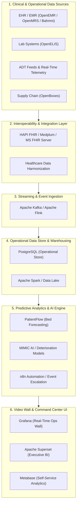

  

  

# 🏥 Awesome Hospital Command Center &amp; Operational Intelligence 🚀

**A Curated Directory of SaaS Platforms &amp; Open-Source Projects for Hospital Command Centers, Patient Flow, Capacity Management, Care Orchestration, Tele-ICU, and Clinical Logistics.**

*Last updated: August 2026*

---

## 📌 Overview

A **Hospital Command Center** (also known as a Clinical Operations Center, NASA-style Health Control Center, or Capacity Management Hub) integrates real-time healthcare data from EHR/EMR systems, ADT event streams, telemetry monitors, RTLS asset trackers, imaging archives, and predictive AI models to centralize decision-making. 

These platforms provide end-to-end visibility and automated orchestration across:
- 🛏️ **Bed Capacity & Placement**: Real-time census tracking, bed turnaround, and predictive admissions.
- 🚑 **Emergency Department & Patient Flow**: ED throughput, triage bottleneck identification, and ambulance diversion mitigation.
- 🔪 **Surgical & Perioperative Suite Optimization**: OR block scheduling, staffing allocations, and turnaround time analytics.
- 🔀 **Transfers & Inter-Facility Logistics**: Health-system transfer center dispatch, ambulance routing, and regional bed coordination.
- 🩺 **Early Warning & Clinical Deterioration**: Real-time NEWS2 / MEWS scoring, sepsis detection, and tele-ICU surveillance.
- 📦 **Hospital Logistics & EVS**: Environmental services prioritization, porter dispatch, and medical supply chain monitoring.

---

## 📑 Table of Contents

- [🏢 SaaS & Hosted Commercial Platforms](#-saashosted-commercial-platforms)
- [💻 Open-Source GitHub Projects](#-open-source-github-projects)
- [🏗️ Reference Architecture for Custom Command Centers](#️-reference-architecture-for-custom-command-centers)
- [🤝 How to Contribute](#-how-to-contribute)
- [📈 Star History](#-star-history)
- [⚖️ Disclaimer](#️-disclaimer)

---

## 🏢 SaaS/Hosted Commercial Platforms

> 📊 **Market Size & Structure**: The global Hospital Command Center and Patient Flow Solutions market is estimated at **$2.1 Billion in 2024** and projected to reach **$7.8+ Billion by 2032** (~17.8% CAGR). The sector exhibits **moderate fragmentation with tiered concentration**: hyperscale cloud and medtech conglomerates anchor foundational data pipelines, telemetry, and compute infrastructure, while specialized operational AI, patient flow, and throughput providers drive ward-level and perioperative capacity optimization.

*The table below is sorted in descending order by **Company Scale** (Valuation / Market Capitalization / Annual Revenue).*

| 🏷️ Product | 🌐 Company Scale | 💡 Focus & Description | 💰 Starting Pricing | 🎁 Free Tier / Trial Limits |
| :--- | :--- | :--- | :--- | :--- |
| **[Microsoft Cloud for Healthcare](https://www.microsoft.com/en-us/industry/health/microsoft-cloud-for-healthcare)** | **~$3.1 Trillion** (Market Cap) / **~$245B** Rev | Healthcare cloud solution offering FHIR interoperability, EHR connectors, patient engagement portals, and operational command-center templates. | $20,000/tenant per month (base healthcare add-on); Azure Health Data Services from $0.20/GB storage + $0.001/query | 30-day free trial with $200 Azure credits + 30-day trial for Dynamics 365 / Power Apps healthcare environments |
| **[NVIDIA Healthcare](https://www.nvidia.com/en-us/industries/healthcare/)** | **~$3.0 Trillion** (Market Cap) / **~$120B** Rev | AI computing infrastructure and healthcare microservices (NVIDIA NIM, Clara, Holoscan) for real-time medical imaging, digital twins, and sensor intelligence. | $4,500/GPU per year (NVIDIA AI Enterprise annual subscription) or $1.00/GPU per hour via cloud marketplaces | 90-day free evaluation license for NVIDIA AI Enterprise & NIM microservices |
| **[Google Cloud Healthcare](https://cloud.google.com/solutions/healthcare)** | **~$2.1 Trillion** (Market Cap) / **~$350B** Rev | Healthcare data platform featuring Cloud Healthcare API (FHIR, HL7v2, DICOM) and BigQuery analytics for hospital command-center operational pipelines. | $0.15/GB-month storage; $0.001 per 10,000 standard requests / $0.10 per 1,000 FHIR transforms | Always Free tier: First 25,000 advanced requests/month & 1 GB storage free; plus 90-day $300 credit trial for new accounts |
| **[AWS for Health](https://aws.amazon.com/health/)** | **~$1.9 Trillion** (Market Cap) / **~$600B** Rev | Healthcare and life sciences cloud infrastructure featuring AWS HealthLake for FHIR data ingestion, query indexing, and operational data lakes. | $0.27/Data Store hour + $0.37/GB-month for storage over 10 GB (Advanced tier) | Includes 10 GB storage and 3,500 FHIR queries/hour within datastore; 12-month AWS Free Tier with $100–$300 promotional credit eligibility |
| **[Palantir Foundry for Health](https://www.palantir.com/solutions/healthcare/)** | **~$140+ Billion** (Market Cap) / **~$2.8B** Rev | Enterprise data ontology and operational intelligence platform for multi-source healthcare data integration, resource allocation, and AI workflow orchestration. | Starting at ~$250,000/year ($20,833/month entry enterprise tier on cloud marketplaces) | 30-day AIP Bootcamp and guided proof-of-concept workspace |
| **[Kaiser Permanente Command Center](https://healthy.kaiserpermanente.org/)** | **~$100+ Billion** (Annual Operating Rev) | Integrated delivery network command-center blueprint for patient throughput, ambulatory care management, and regional bed coordination. | Starting at ~$200,000/year for enterprise reference model and integration architecture | 14-day health-system throughput audit and operational blueprint review |
| **[HCA Healthcare Command Center](https://hcahealthcare.com/)** | **~$85 Billion** (Market Cap) / **~$65B** Rev | Enterprise-scale health-system operations and logistical command-center framework for capacity visibility and patient placement orchestration. | Starting at ~$200,000/year for enterprise co-development and advisory framework | 14-day operational assessment and command-center architecture workshop |
| **[Snowflake Healthcare & Life Sciences](https://www.snowflake.com/en/industries/healthcare-life-sciences/)** | **~$50 Billion** (Market Cap) / **~$3.6B** Rev | Healthcare Data Cloud enabling secure health data sharing, unified patient records, and real-time operational dashboard analytics. | Standard Edition from $2.00/credit (Enterprise from $3.00/credit; ~23 credits/month for baseline XS virtual warehouse) | 30-day free trial with $400 in free compute and storage credits (no credit card required) |
| **[Databricks Healthcare & Life Sciences](https://www.databricks.com/solutions/industries/healthcare-life-sciences)** | **~$43+ Billion** (Valuation) / **~$2.4B** ARR | Lakehouse platform for healthcare data engineering, real-time clinical stream processing, and predictive ML for patient flow and capacity. | From $0.07 to $0.55/DBU (Standard/Premium/Enterprise data engineering & SQL tiers) + underlying compute | 14-day full-featured commercial free trial with up to $400 cloud compute trial credits; permanent Free Edition for individual learning |
| **[GE HealthCare Command Center](https://www.gehealthcare.com/en/products/software/command-center)** | **~$40 Billion** (Market Cap) / **~$19.6B** Rev | Enterprise hospital command-center software integrating source systems for real-time operational insights, capacity management, staffing, and bed orchestration. | Starting at ~$150,000/year base deployment license | 60-day guided evaluation trial in staging sandbox (evaluation only; not for production clinical use) |
| **[Philips Command Center](https://www.philips.com/)** | **~$28 Billion** (Market Cap) / **~$19.5B** Rev | Clinical and operational intelligence platform integrating patient-flow telemetry, radiology workflows, and hospital capacity monitoring. | Starting at ~$100,000/year for core PerformanceBridge / IntelliSpace operations modules | 60-day evaluation trial for select operational analytics modules |
| **[Sg2](https://www.sg2.com/)** | **~$1.5 Billion** (Parent Vizient Rev) / **~$80M+** ARR | Healthcare analytics and market intelligence platform providing forecasting on inpatient/outpatient demand, service-line capacity, and strategic growth. | Starting at ~$25,000/year for core market analytics subscription | 14-day sample market forecasting report and interactive dashboard trial |
| **[TeleTracking](https://www.teletracking.com/)** | **~$1.5 Billion** (Valuation) / **~$180M+** Rev | Real-time patient flow and capacity management platform for bed placement, transfer coordination, environmental services, and transport workflows. | Starting at ~$10/bed/month (~$50,000/year base platform tier) | 30-day interactive simulation pilot / POC upon enterprise qualification |
| **[Biofourmis](https://biofourmis.com/)** | **~$1.3 Billion** (Valuation / Unicorn) | Virtual care and remote patient management platform providing continuous physiological monitoring, predictive analytics, and Hospital-at-Home operations. | Starting at ~$150/monitored patient per month | 30-day remote patient management pilot for up to 25 patients |
| **[LeanTaaS](https://leantaas.com/)** | **~$1.0+ Billion** (Valuation / Unicorn) / **~$100M** ARR | AI and predictive analytics platform (iQueue) for optimizing operating room block utilization, infusion chair scheduling, and inpatient capacity. | Starting at ~$20,000/year per infusion center (~$100,000/year per OR suite) | 30-day historical capacity simulation and ROI diagnostic pilot |
| **[Aidoc](https://www.aidoc.com/)** | **~$1.0+ Billion** (Valuation / Unicorn) / **~$60M** ARR | Clinical AI operating system (aiOS) for radiology triage, acute care notification, and enterprise-wide care coordination. | Starting at ~$30,000/year per imaging AI clinical package (~$3.50/scanned study) | 30-day clinical validation trial on pre-selected radiology feeds |
| **[Qventus](https://www.qventus.com/)** | **~$600 Million** (Valuation) / **~$35M** Rev | AI-powered healthcare operations platform for perioperative scheduling, inpatient discharge planning, and real-time patient-flow automation. | Starting at ~$10,000/month (~$120,000/year per acute care facility) | 45-day retrospective EHR data & operational bottleneck assessment trial |
| **[Care.ai](https://www.care.ai/)** | **~$400 Million** (Acquired by Stryker) | Smart-care facility platform using ambient sensing, virtual nursing, computer vision, and operational intelligence to monitor clinical environments. | Starting at ~$200/smart-room per month (sensor hardware lease + cloud analytics) | 60-day single-department pilot evaluation for up to 10 rooms |
| **[Central Logic](https://www.centrallogic.com/)** | **~$350 Million** (Valuation / About Health) | Patient transfer-center and health-system access orchestration technology for coordinating admissions, bed availability, and inter-facility transports. | Starting at ~$75,000/year per regional transfer-center deployment | 30-day transfer-flow workflow demo & simulation access |
| **[Hospital IQ](https://www.hospiq.com/)** | **~$300 Million** (Merged with LeanTaaS) | Operations management software providing predictive analytics for patient throughput, staffing optimization, and perioperative resource management. | Starting at ~$60,000/year per hospital module (~$15/bed/month base) | 30-day guided operational analytics pilot with historical ADT data |
| **[Artisight](https://www.artisight.com/)** | **~$300 Million** (Valuation / Series B $42M) | Ambient smart-hospital platform using IoT sensors and computer vision for virtual nursing, patient safety, fall prevention, and clinical workflow tracking. | Starting at ~$150/bed per month (sensor IoT infrastructure + software license) | 60-day clinical pilot program for a designated hospital unit |
| **[Corti](https://www.corti.ai/)** | **~$250 Million** (Valuation / Series B $60M) | Real-time clinical AI and voice assistant platform providing clinical consultations, triage guidance, and automatic medical coding. | $4.00/1M input tokens + $16.00/1M output tokens (API); Acceleration Pack from $1,000/month | Free $50 API credit upon console signup; Corti for Startups grants $5,000 in credits valid for 12 months |
| **[XSOLIS](https://xsolis.com/)** | **~$250 Million** (Valuation / $75M Funding) | AI-driven utilization management platform (CORTEX) assessing patient clinical status, medical necessity, and level-of-care determination in real time. | Starting at ~$50,000/year per hospital facility | 30-day retrospective EHR case analysis and medical necessity proof-of-concept |
| **[Laudio](https://www.laudio.com/)** | **~$150 Million** (Valuation / Series B $38M) | Healthcare workforce intelligence and operations platform designed to streamline frontline nursing workflows, leadership engagement, and retention. | Starting at ~$5/employee per month (~$30,000/year per hospital deployment) | 30-day guided pilot for up to 50 frontline managers |
| **[Clew](https://www.clewmed.com/)** | **~$120 Million** (Valuation / $40M Funding) | AI predictive analytics platform for ICU patient deterioration, hemodynamic monitoring, and tele-ICU command-center decision support. | Starting at ~$1,500/ICU bed per year | 30-day ICU retrospective patient data validation trial |

---

## 💻 Open-Source GitHub Projects

Below is a comprehensive collection of open-source projects for building self-hosted, sovereign hospital command centers, bed management consoles, real-time analytics engines, and FHIR interoperability pipelines.

*The list below is sorted in descending order by **GitHub Star Count**.*

1. **[n8n](https://github.com/n8n-io/n8n)**   
   Fair-code workflow automation platform ideal for connecting hospital notification channels, dispatching emergency alerts, bridging HL7/FHIR webhooks, and automating bed turnover escalations.

2. **[Grafana](https://github.com/grafana/grafana)**   
   Industry-standard open-source observability and time-series visualization platform used to construct real-time hospital operations video walls, bed telemetry status monitors, and critical alert panels.

3. **[Apache Superset](https://github.com/apache/superset)**   
   Modern enterprise business intelligence and data visualization platform suitable for operational command-center dashboards, hospital KPI tracking, length-of-stay (LOS) analysis, and capacity metrics.

4. **[Prometheus](https://github.com/prometheus/prometheus)**   
   Leading open-source time-series database and alerting system for monitoring live hospital IoT streams, sensor telemetry, system uptime, and medical device connectivity.

5. **[Metabase](https://github.com/metabase/metabase)**   
   User-friendly open-source business intelligence platform enabling self-service querying and visual reporting for clinical leaders, department heads, and hospital throughput directors.

6. **[Apache Airflow](https://github.com/apache/airflow)**   
   Programmatic workflow orchestration engine used to orchestrate complex healthcare ETL/ELT data pipelines from EHR, ADT, billing, and lab systems into centralized operational data stores.

7. **[Apache Spark](https://github.com/apache/spark)**   
   Unified distributed analytics engine for large-scale healthcare data processing, hospital census forecasting, and batch machine learning for clinical risk scores.

8. **[Apache Kafka](https://github.com/apache/kafka)**   
   Distributed event-streaming platform for ingesting high-throughput real-time hospital events (ADT messages, vital signs telemetry, transfer requests, bed status changes, and lab alerts).

9. **[Apache Flink](https://github.com/apache/flink)**   
   Stateful stream processing framework capable of sub-second real-time event analytics over hospital patient streams and early warning deterioration alerts.

10. **[Prefect](https://github.com/PrefectHQ/prefect)**   
    Modern workflow orchestration framework designed for resilient, reactive healthcare data pipelines and automated operational command-center tasks.

11. **[PostgreSQL](https://github.com/postgres/postgres)**   
    The world's most advanced open-source relational database, providing JSON/JSONB support and ACID guarantees for storing normalized operational, bed management, and patient flow logs.

12. **[Dagster](https://github.com/dagster-io/dagster)**   
    Data orchestration platform built around software-defined assets, ideal for coordinating healthcare data transformation pipelines feeding predictive capacity models.

13. **[HospitalRun](https://github.com/hospitalrun/hospitalrun-frontend)**   
    Open-source hospital management software designed for developing-world clinics and regional hospitals, featuring outpatient management, patient scheduling, and ward tracking.

14. **[OpenEMR](https://github.com/openemr/openemr)**   
    ONC-certified open-source electronic health records and medical practice management platform serving as a comprehensive data source for operational analytics.

15. **[MIMIC Code](https://github.com/mit-lcp/mimic-code)**   
    MIT-developed repository of SQL scripts, predictive algorithms, and analytics benchmarks for the MIMIC critical-care database, widely used for training tele-ICU and command-center triage models.

16. **[Synthea](https://github.com/synthetichealth/synthea)**   
    Synthetic patient population simulator generating realistic, HIPAA-compliant patient medical histories and flow events for testing hospital command center architectures.

17. **[Medplum](https://github.com/medplum/medplum)**   
    Modern headless, FHIR-native healthcare developer platform providing APIs, clinical bots, scheduling, EHR backbones, and operational command-center developer SDKs.

18. **[CareKit](https://github.com/carekit-apple/CareKit)**   
    Open-source software framework for building apps that help patients manage their medical conditions, track care plans, and stream continuous patient-reported outcomes to hospital coordination teams.

19. **[HAPI FHIR](https://github.com/hapifhir/hapi-fhir)**   
    Complete open-source implementation of the HL7 FHIR standard in Java, providing the core interoperability backbone for uniting disparate EHR, lab, and bed systems into a command center.

20. **[OpenMRS](https://github.com/openmrs/openmrs-core)**   
    Modular, enterprise-grade open-source electronic medical record platform deployed across global healthcare systems to provide core clinical data layers.

21. **[Microsoft FHIR Server](https://github.com/microsoft/fhir-server)**   
    Open-source, enterprise-grade implementation of the FHIR specification designed for rapid data ingestion and health data management in cloud-native environments.

22. **[OpenBoxes](https://github.com/openboxes/openboxes)**   
    Open-source supply chain and inventory management system designed for healthcare facilities to monitor medical equipment, medications, and clinical supplies.

23. **[Frappe Health](https://github.com/frappe/health)**   
    Full-featured open-source Hospital Information System (HIS) with inpatient bed management, appointment scheduling, laboratory tracking, and billing operations.

24. **[SMART on FHIR JavaScript Client](https://github.com/smart-on-fhir/client-js)**   
    Client library for connecting browser-based clinical web applications and interactive command-center dashboards directly to FHIR-compliant EHR systems.

25. **[DHIS2](https://github.com/dhis2/dhis2-core)**   
    Global open-source health management information system (HMIS) platform for aggregate health data, district-level capacity reporting, and epidemiological tracking.

26. **[Google Cloud Healthcare Data Harmonization](https://github.com/GoogleCloudPlatform/healthcare-data-harmonization)**   
    Engine and configuration language for converting legacy healthcare data formats (HL7 v2, CCDA) into standard FHIR representations for centralized analytics.

27. **[Bahmni](https://github.com/Bahmni/bahmni-core)**   
    Integrated open-source hospital information system combining OpenMRS, OpenELIS, and ERP workflows into a unified hospital operations interface.

28. **[OpenELIS Global](https://github.com/openelisglobal/openelisglobal-core)**   
    Open-source enterprise Laboratory Information System (LIS) providing turnaround-time tracking and specimen analytics for hospital command centers.

29. **[PatientFlow](https://github.com/UCL-CORU/patientflow)**   
    Open-source Python package developed by UCL Clinical Operational Research Unit for predicting short-term hospital bed demand from real-time patient streams to aid bed managers.

30. **[Hospital Bed Management System](https://github.com/Ansarimajid/Hospital-Management-System)**   
    Open-source implementation for monitoring bed availability, ward allocations, and patient transfers in hospital departments.

31. **[MedCore](https://github.com/Globussoft-Technologies/medcore)**   
    Open-source hospital management system covering live emergency-room boards, bed status, laboratory workflows, and surgical scheduling.

32. **[ClinicalOS](https://github.com/DrARTBuilds/ClinicalOS)**   
    Open-source AI-native hospital operations layer featuring operational intelligence dashboards, patient intake routing, bottleneck analytics, and clinician decision support.

33. **[BedFlow AI](https://github.com/draculess99/BedFlow_AI)**   
    AI-driven hospital bed management prototype designed to predict bed availability and recommend optimal patient placement to alleviate emergency department boarding.

34. **[Hospital Operations Analytics](https://github.com/Denis0242/Hospital-Operations-Analytics)**   
    Open-source healthcare operations analytics dashboard providing executive views on patient flow, length-of-stay bottlenecks, readmissions, and department strain.

---

## 🏗️ Reference Architecture for Custom Command Centers

A modern open-source hospital operational command center can be constructed by combining the following specialized architectural layers:

---

## 🤝 How to Contribute

We welcome contributions from clinicians, hospital operations directors, health informaticists, and software engineers!

1. 🍴 **Fork the repository**.
2. 🌿 **Create a feature branch**: `git checkout -b feature/add-new-command-center`.
3. 📝 **Add or update entries**:
   - For SaaS products: Include name, link, company scale, description, starting pricing, and exact free tier/trial limits.
   - For Open-Source projects: Include name, link, stargazer badge (`style=social&color=white`), and concise operational description.
4. ✅ **Ensure accuracy**: Verify licensing, pricing tiers, and active maintenance status.
5. 🚀 **Submit a Pull Request** with a brief summary of additions.

---

## 📈 Star History

---

## ⚖️ Disclaimer

- This repository is a **community-curated index** and does not constitute commercial endorsement or medical advice.
- Commercial hospital command-center platforms and open-source packages differ substantially in regulatory clearance (FDA 510(k), CE mark, HIPAA compliance), SLAs, cybersecurity posture, and clinical validation.
- Always review current software licensing, patient privacy safeguards, and clinical governance protocols before deploying operational tools in production hospital settings.

---

**Built for hospital leaders, COOs, bed managers, patient-flow coordinators, clinicians, health IT specialists, and innovators building the future of real-time healthcare intelligence.** 🏥✨

